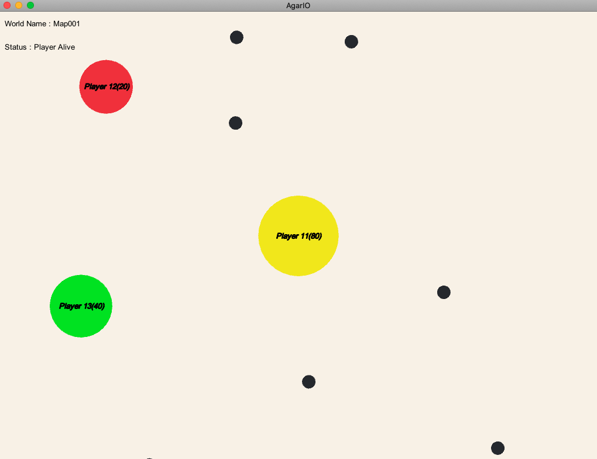
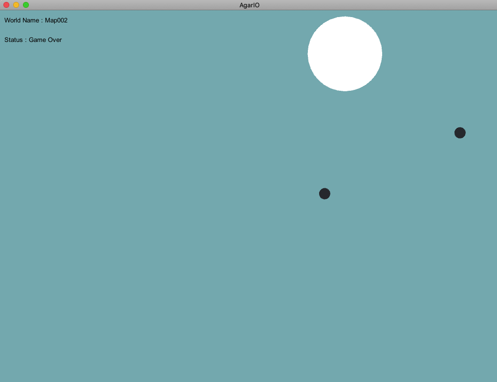
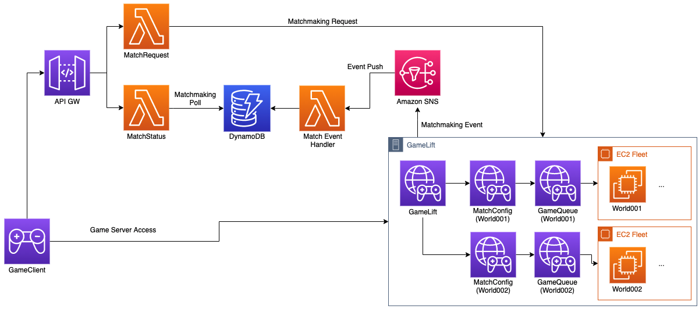

# Persistent Game Server with Amazon GameLift

This sample includes how to implement persistent game server based on Amazon GameLift.

Sample game of this workshop is AgarIO which is famous Massive Multiplayer Online Action Game.     
About the game, You can find detail information in here (https://en.wikipedia.org/wiki/Agar.io).

This sample game includes 2 World Server Fleets for Persistent Game service.

* First Game World

* Second Game World (Boss Included!)

  - Provides GameLift sample for Unity
  - Implement scalable architecture for MMO like persistent game servers.
  - Include Latest best practices for GameLift Architecture.

* How to Run
Open Game Client and run with API Gateway url.
You can refer how to do in our [Workshop materials](http://gamelift-persistent-workshop.s3-website.ap-northeast-2.amazonaws.com/en/)

# GameLift Architecture Features

  - Design multiple queues and fleets for each world servers. (Scalable!)
  - Implement poll-based patterns for matching scalable users.

# Workshop
 - EN : [Workshop(English)](http://gamelift-persistent-workshop.s3-website.ap-northeast-2.amazonaws.com/en/)
 - KO : [Workshop(Korean)](http://gamelift-persistent-workshop.s3-website.ap-northeast-2.amazonaws.com/ko/)

# Demo Video
 - Video : [Link](https://gamelift-persistent-workshop.s3.ap-northeast-2.amazonaws.com/GameLift-MMO.mp4)

### Todos
 - Add other modules (Login, Game Result Handling)
 - Including Analytics
 - Add Test Tools

### Installation

 - Clone this Repository 
 To start this repository, you can Run this command for this repository to clone.
 Or you are able to follow Instructions from our [Workshop Material]()

 - Install Unity MLAPI

 Unity MLAPI is an open source framework that simplifies building networked games in Unity.
 As this library joins the Unity ecosystem, this project includes MLAPI as its Networking Library. ([Official Blog](https://blogs.unity3d.com/2020/12/03/accelerating-unitys-new-gameobjects-multiplayer-networking-framework/?_ga=2.256478095.584731899.1613809160-1332364721.1600864695))
 In order to run this sample, you need to import MLAPI source code / DLL in this repository.

* Please Note : MLAPI is continuously updated for next generation of Unity Network Engine. The workshop will be updated continuously, but MLAPI compatibility issues may arise. If you are interested in using this sample code directly, I strongly recommand you to check the latest update of MLAPI.

 You are able to follow one of following guide links to install MLAPI.     
 (1) [MLAPI Installation](https://mp-docs.dl.it.unity3d.com/docs/getting-started/about-mlapi)

 (2) [Workshop Material](http://gamelift-persistent-workshop.s3-website.ap-northeast-2.amazonaws.com/en/)
 
 - Install GameLift SDK
 You should Install GameLift SDK from our [official homepage](https://aws.amazon.com/gamelift/getting-started/?nc1=h_ls).
 And It should be included under "Assets" folder.    

 This information is also included in our [Workshop Material](http://gamelift-persistent-workshop.s3-website.ap-northeast-2.amazonaws.com/en/)

 - Install Through Unity Package
 You are able to run Unity Package to import tested source code. It will be the easiest way to import working source codes.
 Before you import the package, you need to [install MLAPI first](https://mp-docs.dl.it.unity3d.com/docs/migration/install).

## Security

See [CONTRIBUTING](CONTRIBUTING.md#security-issue-notifications) for more information.

## License

This library is licensed under the MIT-0 License. See the LICENSE file.

